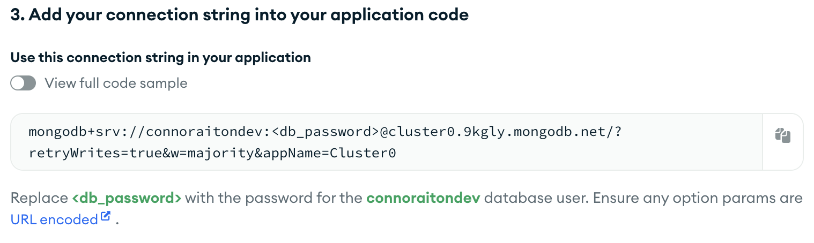

# 🛡️ OSSDoorway: A Gamified Learning Environment for OSS Contributions

OSSDoorway is a free, open-source platform designed to engage users in learning about the open-source software (OSS) contribution process through interactive quests. Users embark on educational quests that guide them through the various stages of OSS contributions, such as submitting pull requests, writing documentation, and solving issues. Each quest is designed to be both informative and engaging, incorporating game elements like progression bars, XP, and levels.

OSSDoorway quests and activities are designed to be accessible and inclusive, ensuring that users from diverse backgrounds and skill levels can benefit from the platform. Join OSSDoorway today and start your journey towards becoming a proficient OSS contributor!

---


## Requirements:
- [Node.js 22+](https://nodejs.org/en/download) AND/OR Docker
- npm 10+
- MongoDB


## Setup:
***NOTE: Under heavy use you will want to use a different GitHub account as this will mess up or pad your commit history.***

### Organization
1. As of now, the bot expects to take control of an organization, to create one, go [here](https://github.com/organizations/plan) and create a free organization
2. On the setup, you may want to consider inviting other developers when prompted (make them org owners if you want them to have admin access to bot commands )
3. Now youll want to create a two repos, a public "open source" repo (make sure to click add readme, otherwise github API may not work) and a private repo to run bot commands to set up your users' environments. The bot will want the repo link later, so for instance, we want ```caiton1/OSS-Doorway``` from ```https://github.com/caiton1/OSS-Doorway```
4. Organization setup complete
---

### Database
First, you're going to need to setup a MongoDB database for the bot to store user progress in. For this project I use the free tier of MongoDB Atlas.

**[Cloud MongoDB](https://account.mongodb.com/)**
1. Sign up or login to account

2. If you are a new Atlas user, complete setup questions. If not you can skip the database section  and move on to [Probot](#probot-setup), you will need your URI to connect to the database.


4. On initial setup, choose the free option and click create deployment.


6. Next you will need to create an atlas admin user (make sure to remember password and username!).

7. Click create database user.

8. Next, click choose connection method (or the connect buttonon the cluster dashboard) and click *Drivers* under *"Connect to your application"*.
   - It may say your cluster is provisioning, in which case click done, wait a few minutes until cluster is created, then click connect and click *Drivers* under *"Connect to your application"*.



9. Save the link as shown above, ***replacing <db_password>*** with the password you created earlier.

10. Setup complete, the URI link will be used in the [Probot](#probot-setup) section.

***NOTE:*** For simplicity, I am using the admin account to connect to the database, in a production environment, you should NOT do this and should set up a separate least privilege account to access the database.

---

### Probot setup
1. Clone or download this repo.

2. install dependencies (manually or with docker).
   - Manually:
     1. run ```npm install```
     2. run ```npm start```
    
   - If you want to use docker (good if you have a environment that uses a different version of JS):
     1. build docker ```docker build -t oss-dev .```
     2. run docker, binding to project root directory for more seemless development
```
docker run -it --rm \
  -v "$(pwd)":/app/OSS-doorway \
  -v "$(pwd)/.env":/app/OSS-doorway/.env \
  -p 3000:3000 \
  oss-dev
```
  - -it means interactive terminal, if you want to run it in background, swap it out with -d for detached mode

3. Go to the provided link from terminal while running server, usually [http://localhost:3000](http://localhost:3000).


4. Click on register app.

5. Then install it to your [organization](#organization) that you created.

6. Make sure it has access to all repositories in organization and click install.

7. Kill the server and then re-run it from either npm start or the docker command above.

8. If not already in .env file, it will ask for URI, DB_NAME and OSS_REPO.

9. Fill in using the URI that you saved from database setup step 9 [earlier](#database).

10. Fill in the database/collection name you want.

11. Fill in the OSS repo that you created from step 3 organization [earlier](#organization).

12. Setup complete, keep the server running while using/developin).
---

### Commands and How to Use
- To interact with the bot, create a issue in the issues tab of your private repo, this is the main method of communication with the bot
  
- The general structure of the bot involves three parts:
  - A sandbox OSS repo that the bot will pull information from
  - User repos that are created by the admins, these are where the user will interact with the bot, mainly from the issues tab. The README of these repos represent the users current progress.
  - Admin repo, the main purpose of this private repo is to run admin commands (also from the issues tab) to create, reset and destroy repos

**To set up your first repo:**

1. In your created organization, go to your private repo that you designated for bot commands and create a new issue while running the server.

2. It will show you commands that you can do.

3. To get started, you can type ```/create_repos <some valid github username>``` and it will create a user in database and create a repo for the user in the organization (will take a few seconds to complete).

4. The invited user should recieve an invite to the bot-created private repo, which will be named after the user.

